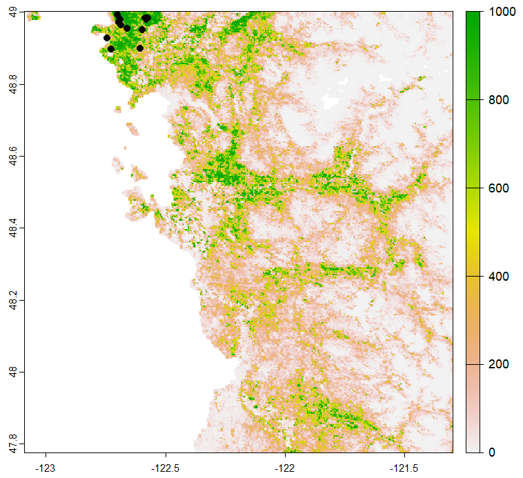

<!-- README.md is generated from README.Rmd. Please edit that file -->

# enmRoute 

<!-- badges: start -->
<!-- badges: end -->
enmRoute seamlessly employ habitat suitability predictions for planning field survey. The aim of this package is to use ecological niche model habitat suitability 
predictions to plan the field survey of invasive species in an expected area. Our platform would promote detection and faciliate 
earlier eradications programs in invasive species management. We hypothesize that field surveys that account for habitat 
suitability predictions could promote field collections and capture more individuals in the field. 
Our model-based survey route accounts for habitat suitability predictions and uses practicable driving time/distance to optimize survey efforts, 
we hope that this package and its accompanying shiny (https://losorio.shinyapps.io/enmroute) will help field biologists design sampling routes for regional and national surveys.

Key Words: Survey route, Optimization, Ecological Niche Model, Habitat suitability, Carrying Capactiy Index (CCI)


###########################################################################################

The core function of enmRoute is to generate and optimize survey routes for invasive species surveillence:

enmRoute (pred1, pred2, p, r, obs, b)

pred1: Suitability prediction from an ecological niche model, input as a raster from the terra package, the habitat suitability ranging 0-1000, 

pred2: Binary prediction from ecological niche model, input as a raster also from the terra package

p: Size of tiny patches to be discarded (km2)

r: Number of low ranked patches to be discarded, they are ranked by Carrying Capacity Index (CCI).

obs: Observations of introduced populations, input as a csv with two colum of longitude and latitude.

b: The buffering distance of these observations, the unit is meter.


###########################################################################################

enmRoute uses suitability predictions and observations to optimize invasive species surveys, it can work under different conditions, 
we illustrate these in detail below.

1)  This Exercise 1 guides user step by step to generate a survey route, it demonstrates the inventory scheme for an invasive species (Northern giant hornet: Vespa mandarinia)
    that has established population at the earlier stage. Vespa mandarinia is native to Eas Asia, and has only been detected in Pacific Northwest, this species provided a model case
    to test our framework for a species where early detection and eradication is a high priority, this example uses both introduced observations and habitat suitability predictions to generate candidate
    survey patches, the exercies provide a survey route/scheme for Northern giant hornet detection in Washington State in United States. 

3)  Exercise 2 is demostrating the idea of survey route optimization, i.e, how to optimize the driving survey route for invasive species surveying. 

## Installation

We can install the `enmRoute` package from GitHub, using the `devtools`
package:

``` r
library(devtools)
devtools::install_github('gpzhu/enmRoute')
```

## loading dependency packages

``` r
library(enmRoute)
library(sf)
library(terra)
library(osrm)
library(leaflet)
library(smoothr)
library(exactextractr)
library(ggpmisc)
library(ggpubr)
```

## Exercise 1

This exercise guides users step by step to generate
a survey route. The first step is to change the Ecological Niche Model
suitability prediction into a binary prediction. The binary predictive
surface is then transformed into polygons/patches, which were then combined 
with the buffering of introduced distributional records to generate candidate suvery patches.  

Two procedures are employed below to prioritize these patches, by removing tiny patches (here \<
3km2) and discarding low carrying capacity index (CCI) ranked patches (here, 23 CCI
rear patches).

User inputs data: 

Occurrence data (occ): occurrence data with two columns of longitude and latitude for converting suitability into binary
predictions, and for generating the candidate survey patahces.

Suitability prediction (pred1): a raster surface representing suitability prediction, that could be attained using an ecological niche
model.

Binary prediction (pred2): a raster surface representing binary prediction (presence/absence), that could be attained by thresholding the suitability prediction.

Patch size limit (p): minimum patch size (km2) that should be considered in the survey.

Carrying Capacity Index (CCI) limit (r): used to set the boundary for discarding low CCI ranked patches.

Buffering distance (b): the buffering distance (meter) of observed introduced records.

``` r

###########################################################################################
### read system file data ###
occ <-read.csv(system.file("extdata", "occ.csv", package="enmRoute"))
pred1 <-rast(system.file("extdata", "WA.tif", package="enmRoute"))

#### Take a glance to see how the input data look like
plot(pred1)
points(occ,pch = 16)
```



``` r
################################## Note #####################################
#### Currently, we use WGS84, you may change coordinate system into a different equal area projection for the below running of optimization,
#### But you have to change it back to WGS84 below before get the route  ####

#### Threshold model prediction at the 10th training threshold, this threhold is highly conservative in estimating distribution ####
pred2 <- thd(pred1 = pred1, points = occ, type = "p10", binary = TRUE)

## Alternatively, you can use other thresholds (e.g., mtp) to get binary prediction, see detail in thd function.
## rc <- thd(pred1 = pred1, points = occ, type = "mtp", binary = TRUE)
## User may also choose an arbitary threshold (here 388) that is between 0-1000, see discussion on threshold in survey route optimization. 
## rc <- thd(pred1 = pred1, threshold = 388, binary = TRUE)

# Get the buffering of introducted distributional records, the buffering distance unit is meter.

buf<- buf(obs = occ, b = 1000)

## Preparing the candate polygons/patches, candidate surveying patch/polygons from binary predictions and
## the buffering of introduced distributional records. 
## pred2: binary prediction, rast object.
## obs: observed introduced distributional records, with two column of longitude and latitude.
## b: the buffering distance of observed records, unit is meter.
can<-canD(pred2 = pred2, obs = occ, b = 1000)

dim(can)
# [1] 2517    4
# There are 2517 patches generated, this is too much for regular survey, we employ below 2 steps to optimize the survey route. 
###########################################################################################
#### The 1st round prioritization ###
#### Ranking and prioritizing patches by removing tiny pieces (< 3km2), ####
pp<-rankCI(pred1 = pred1, canD = can, p = 3)

### These are patches that were reserved after 1st round optimization. 
dim(pp)
#> [1] 53  6

head(pp)
# Simple feature collection with 6 features and 5 fields
# Geometry type: POLYGON
# Dimension:     XY
# Bounding box:  xmin: -123.0657 ymin: 48.77265 xmax: -121.9609 ymax: 49.00214
# Geodetic CRS:  WGS 84
#     patches agg_n Capacity                       geometry Patch_size Rank
# 4         3    13  2008458 POLYGON ((-122.5707 48.9988...       2586   53
# 10       11     1   935502 POLYGON ((-122.2461 48.9365...       1382   51
# 22       25     1    35881 POLYGON ((-123.0297 48.9923...         47   23
# 36       41     1   201247 POLYGON ((-122.3969 48.9464...        265   46
# 71       85     1    53844 POLYGON ((-122.8034 48.9431...         71   34
# 151     190     1    23033 POLYGON ((-121.9839 48.8972...         37    4

### You may write out polygon of 1st round prioritization ###
st_write(pp, "1th_polygon.shp")

###########################################################################################
#### The 2nd round prioritization ###
#### There are 53 paches reserved after 1st round prioritization,
#### With this number, the user can decide how many patches are going to be discarded ######
#### Here, select high ranked/priority patches by discarding the rear 23 CI ranked patches ####
sub<-subset(pp, Rank > 23)

### These are patches that were reserved after 2nd round optimization.
dim(sub)
#> [1] 30  6

head(sub)
# Simple feature collection with 6 features and 5 fields
# Geometry type: POLYGON
# Dimension:     XY
# Bounding box:  xmin: -122.8133 ymin: 48.77265 xmax: -122.0003 ymax: 49.00214
# Geodetic CRS:  WGS 84
#     patches agg_n Capacity                       geometry Patch_size Rank
# 4         3    13  2008458 POLYGON ((-122.5707 48.9988...       2586   53
# 10       11     1   935502 POLYGON ((-122.2461 48.9365...       1382   51
# 36       41     1   201247 POLYGON ((-122.3969 48.9464...        265   46
# 71       85     1    53844 POLYGON ((-122.8034 48.9431...         71   34
# 157     198     1    47539 POLYGON ((-122.4428 48.9169...         75   31
# 235     285     1   591013 POLYGON ((-122.4363 48.8742...        910   49

### Get centroid for generating survey route ####
ct<-st_centroid(sub)

dim(ct)
#> [1] 30  6

head(ct)
# Simple feature collection with 6 features and 5 fields
# Geometry type: POINT
# Dimension:     XY
# Bounding box:  xmin: -122.7835 ymin: 48.83717 xmax: -122.1474 ymax: 48.9534
# Geodetic CRS:  WGS 84
#     patches agg_n Capacity                   geometry Patch_size Rank
# 4         3    13  2008458  POINT (-122.6434 48.9199)       2586   53
# 10       11     1   935502 POINT (-122.1474 48.93689)       1382   51
# 36       41     1   201247 POINT (-122.3668 48.94929)        265   46
# 71       85     1    53844  POINT (-122.7835 48.9534)         71   34
# 157     198     1    47539 POINT (-122.4444 48.90569)         75   31
# 235     285     1   591013 POINT (-122.3689 48.83717)        910   49

### You may write out polygon of 2nd round prioritization ###
st_write(sub, "2th_polygon.shp")

### You may write out the survey centroids ###
st_write(ct, "My_centroid.shp")

#### You may use osrmTrip function (osrm package) to get the route here, makesure your coordinate system is WGS84 ######
ctxy<-as.data.frame(st_coordinates(ct))
trips <- osrmTrip(loc = ctxy, returnclass = "sf")
mytrip <- trips[[1]]$trip

### You may write out the survey route ###
st_write(mytrip, "My_trip.shp")

###########################################################################################
### Based on former 1st and 2nd round prioritization, the user can decide how many patches can be removed,
### during 1st (p) and 2nd (r) round prioritizations,
### so, it is ready to run enmRoute 

mm<-enmRoute(pred1 = pred1, pred2 = pred2, p = 3, r = 23, obs = occ, b = 1000)  

### loading results ###
mytrip<-mm$geometry

#### get survey driving time (min) ####
sum(mm$duration)
#> [1] 1021.515

#### get survey driving distance (km) ####
sum(mm$distance)
#> [1] 787.8568

### You may write out survey route ###
### st_write(mytrip, "Mytrip.shp")

###########################################################
### Plot and plan the trip ###
### Solid red line denote proposed survey route,
### Blue and yellow area represent represent patches that were generated by ecological niche model predictions and distributional records buffering. 
### Red areas mean patches that were reserved after 2 rounds of prioritizations, dropped pins denote centroids of high ranked patches
xy<-st_coordinates(ct)
ggg<-leaflet()%>%
  addPolygons(data=mytrip,fillOpacity=0,color="red",stroke=T)%>%
  addMarkers(data=xy)%>%addTiles()%>%
  addRasterImage(pred2, colors = "blue", opacity = 0.8)%>%
  addPolygons(data=sub,fillOpacity=0.5,color="red",stroke=T)%>%
  addPolygons(data=buf,fillOpacity=0.5,color="yellow",stroke=T)
  
ggg

### You may write out below result as html widget ###
library(htmlwidgets)
saveWidget(ggg, file = "enm_RouteMap.html")
```


## Exercise 2

This is an advanced exercise which could help the user to optimize a survey
route. It works by running the above procedure in an iterative
manner to generate the relationship between survey expense and number of
patches that will be surveyed. Total survey expenses would depend on surveying
expense spent in these high ranked patches and driving time between the
patches. The driving time (i.e., minute)/distance (i.e., kilometer)  would be 
closely correlated with the distance between the centroids of these patches. 
Patch survey expense would be scaled with the accumulated capacity index (CI) in these high ranked
patches, as high CI accumulated means more sample should be deployed.

Ts = td + β * CCIs

In this example, I select 30 patches after removing tiny (\< 3 km2) and
low ranked (rear 23 patches) to test the relationship between survey
expense and number of sampled patches. With this relationship, the field
biologist could decide which/how many patches are going to be used for
deploying samples, given available time and resources.

User inputs: 

Occurrence data (occ): occurrence data with two columns of longitude and latitude for converting suitability into binary predictions,
and for generating the candidate survey patahces.

Suitability prediction (pred1): a raster surface representing suitability prediction, that could be attained using ecological niche model. 

Binary prediction (pred2): a raster surface representing binary prediction (presence/absence), that could be attained by thresholding suitability prediction.

Patch size limit (p): minimum patch size that should be considered in the survey.

Capacity index limit (r): capacity index used to discard low suitability patches.

Iterative number (u): Number of patches to be iterative removed (u).

``` r
### read system file data ###
occ <-read.csv(system.file("extdata", "occ.csv", package="enmRoute"))
pred1 <-rast(system.file("extdata", "WA.tif", package="enmRoute"))

#### Threshold model prediction ####
pred2 <- thd(pred1 = pred1, points = occ, type = "p10", binary = TRUE)

## To start optimization, we will use candidate patches/polygons that generate from former excise. 
can<-canD(pred2 = pred2, obs = occ, b = 1000) #This would generate 2517 patches/polygons.

# We calculate CCI for these patches, and then rank them by CCI, we optimize firstly by removing some small size patches (<3 km2).
pp<-rankCI(pred1 = pred1, canD = can, p = 3)

### These are patches that were reserved after 1st round optimization.
dim(pp)
#> [1] 53  6

head(pp)
# Simple feature collection with 6 features and 5 fields
# Geometry type: POLYGON
# Dimension:     XY
# Bounding box:  xmin: -123.0657 ymin: 48.77265 xmax: -121.9609 ymax: 49.00214
# Geodetic CRS:  WGS 84
#     patches agg_n Capacity                       geometry Patch_size Rank
# 4         3    13  2008458 POLYGON ((-122.5707 48.9988...       2586   53
# 10       11     1   935502 POLYGON ((-122.2461 48.9365...       1382   51
# 22       25     1    35881 POLYGON ((-123.0297 48.9923...         47   23
# 36       41     1   201247 POLYGON ((-122.3969 48.9464...        265   46
# 71       85     1    53844 POLYGON ((-122.8034 48.9431...         71   34
# 151     190     1    23033 POLYGON ((-121.9839 48.8972...         37    4

###### Tune candidate sites for routing ##########
###### shp is the output of rankCI ###
###### r, number of low ranked patches to be removed ###
###### u, number of patches to be iterative removed ### 
cc<-tuneSite(shp=pp, r=23, u=1)

### These are patches that were reserved after 2nd round optimization.
dim(cc)
#> [1] 21  5

head(cc)
#  Proportion_of_patches Driving_time Driving_distance Accumulated_capacity Patch_size
# 1                  0.25     863.4050         669.7189              8532732      12335
# 2                  0.24     836.9117         653.3762              8486656      12269
# 3                  0.23     780.8533         641.3595              8440438      12188
# 4                  0.22     771.5617         633.7593              8392899      12113
# 5                  0.21     746.2750         617.4958              8344744      12039
# 6                  0.20     733.3150         621.9432              8293431      11952

### You may write out iterative running result ###
write.csv(cc, "Iteration_result.csv", row.names = F)

###plot tuneSite results###
### Relation between survey time/distance and proportion of patches to be sampled
eee<-ggplot(cc, aes(x=Proportion_of_patches, y=Driving_time)) +
     geom_point(size = 5, color = "#FFFFFF", fill = "#000000", shape = 21)+
     geom_smooth(se = T, method = "lm", linewidth=2)+
     stat_poly_eq(aes(label = after_stat(eq.label)),label.y = "bottom", label.x = "right") +
     stat_poly_eq(label.y = 0.9) +
     theme(plot.subtitle = element_text(family = "serif", size = 12, colour = "gray0"), 
        plot.caption = element_text(colour = "gray0"), 
        axis.title = element_text(size = 12), 
        axis.text = element_text(size = 12, colour = "gray0"),
        axis.line = element_line(linetype = "solid"),
        plot.title = element_text(size = 12)) +labs(y = "Driving time (min)", x = "Proportion of patches to be sampled")+
     scale_y_continuous(breaks=seq(0,4500,500))

### Relation between accumulated CCI and proportion of patches to be sampled
formula <- y ~ poly(x, 3, raw = TRUE)
fff<-ggplot(cc, aes(x=Proportion_of_patches, y=Accumulated_capacity)) +
  geom_point(size = 5, color = "#FFFFFF", fill = "#000000", shape = 21)+
  stat_poly_line(formula = formula, linewidth=2,se = T) +
  stat_poly_eq(use_label("eq"), formula = formula,label.y = "bottom", label.x = "right")+
  stat_poly_eq(use_label("R2"), formula = formula)+
  #geom_smooth(se = FALSE, method = "lm", size=2)+
  theme(plot.subtitle = element_text(family = "serif", size = 12, colour = "gray0"), 
        plot.caption = element_text(colour = "gray0"), 
        axis.title = element_text(size = 12), 
        axis.text = element_text(size = 12, colour = "gray0"),
        axis.line = element_line(linetype = "solid"),
        plot.title = element_text(size = 12)) +labs(y = "Accumulated capacity", x = "Proportion of patches to be sampled")
        
ggarrange(eee, fff, labels = c("A", "B"))
```


``` r

### Finall, to help users choose parameters for running enmRoute, the scatter diagrams of accumulated CCI against driving time or distance
### that were generated in the heuristic search were plotted and regressed.
### The line (i.e., Pareto curve) that was fit to these scatter points is used to estimate patch capacity or size based on driving time

formula <- y ~ poly(x, 2, raw = TRUE)
hhh <-ggplot(cc, aes(x=Driving_time, y=Accumulated_capacity)) +
  geom_point(size = 5, color = "#FFFFFF", fill = "#000000", shape = 21)+
  stat_poly_line(formula = formula, linewidth=2,se = T,color = "red") +
  stat_poly_eq(use_label("eq"), formula = formula,label.y = "bottom", label.x = "right",size = 6)+
  stat_poly_eq(use_label("R2"), formula = formula,size = 6)+
  #geom_smooth(se = FALSE, method = "lm", size=2)+
  theme(plot.subtitle = element_text(family = "serif", size = 12, colour = "gray0"), 
        plot.caption = element_text(colour = "gray0"), 
        axis.title = element_text(size = 20), 
        axis.text = element_text(size = 16, colour = "gray0"),
        axis.line = element_line(linetype = "solid"),
        plot.title = element_text(size = 12)) +
  labs(x = "Driving time (min)", y = "Accumulated capacity")

hhh

```


References:

Baguette, M. and Stevens, V. 2013. Predicting minimum area requirements of butterflies using life-history traits. - J Insect Conserv 17: 645–652.

Hui, C. 2006. Carrying capacity, population equilibrium, and environment’s maximal load. - Ecological Modelling 192: 317–320.

Pearson, R. G. et al. 2007. Predicting species distributions from small numbers of occurrence records: A test case using cryptic geckos in Madagascar. - Journal of Biogeography 34: 102–117.

Zhu, G. P. et al. 2021. Assessing the ecological niche and invasion potential of the Asian giant hornet. PNAS. 117: 24646-24648
