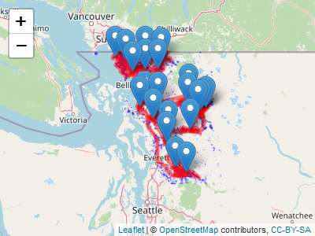
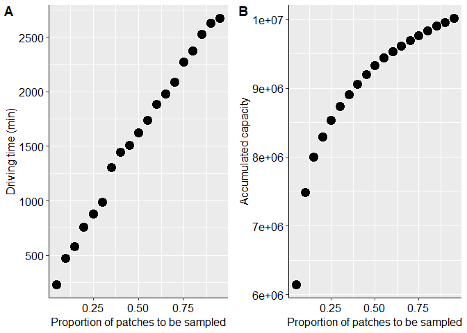

<!-- README.md is generated from README.Rmd. Please edit that file -->

# enmRoute

<!-- badges: start -->
<!-- badges: end -->

The aim of this package is to use ecological niche model prediction to optimize biodiversity survey in an expected area.
The goal of the package is to capture more individuals in field surveys by using our ecological niche model-based route tool.
We hope our model-based route could help field biologists design sampling routes for regional and national surveys.

## Installation

We can install the `enmRoute` package from GitHub, using the `devtools`
package:

``` r
library(devtools)
devtools::install_github('gpzhu/enmRoute')
```
## loading dependency packages
``` r
library(enmRoute)
library(raster)
library(leaflet)
library(maptiles)
library(mapsf)
library(osrm)
library(ggpubr)
library(smoothr)
library(exactextractr)
```

## Example 1

This is a basic approach which guides the user step by step to generate a survey route. 
The first step is to change the Ecological Niche Model suitability prediction into a binary prediction. 
The binary predictive surface is then transformed into polygons/patches. 
Two procedures are employed to prioritize these patches, by removing tiny patches (here < 5km2) and discarding low capacity index (CI) ranked patches (here, 10 CI rear patches).

User inputs data:
Occurrence data (occ): an occurrence data with two columns of longitude and latitude for converting suitability into binary predictions;
Suitability prediction (sdm): a raster surface representing suitability prediction, that could be attained using ecological niche model;
Patch size limit (p): minimum patch size that should be considered in the survey;
Capacity index limit (r): capacity index limit used to discard low suitable/small size patches.
``` r
### read system file data ###
occ <-read.csv(system.file("extdata", "occ.csv", package="enmRoute"))
r<-raster(system.file("extdata", "WA.tif", package="enmRoute"))

#### Threshold model prediction at the threshold of 388 ####
rc <- thd(sdm = r, threshold = 388, binary = TRUE)

## Alternatively, you can use other thresholds (e.g., mtp, p10) to get binary prediction, see detail in thd function
#rc <- thd(sdm = r, points = occ, type = "mtp", binary = TRUE)
#rc <- thd(sdm = r, points = occ, type = "p10", binary = TRUE)

###########################################################################################
#### The 1th round prioritization ###
#### Ranking and prioritizing patches by removing tiny pieces (< 5km2) ####
pp<-rankCI(rc, p=5)

### These are patches that were reserved after 1th round optimization. 
dim(pp)
#> [1] 31  5

head(pp)
#> Simple feature collection with 6 features and 4 fields
#> Geometry type: POLYGON
#> Dimension:     XY
#> Bounding box:  xmin: -122.2297 ymin: 47.77604 xmax: -121.6069 ymax: 48.27762
#> Geodetic CRS:  WGS 84 (with axis order normalized for visualization)
#>    WA                       geometry  Capacity Patch_size Rank
#> 1   1 POLYGON ((-121.9347 47.7826...  40139.98   59.99998    5
#> 4   1 POLYGON ((-121.6069 47.8350... 557078.88  856.99994   26
#> 7   1 POLYGON ((-121.9445 47.9137...  51313.00   87.00003   11
#> 9   1 POLYGON ((-122.2166 48.0514...  34972.00   61.00001    2
#> 11  1 POLYGON ((-122.056 48.14649...  59964.98  108.99998   14
#> 12  1 POLYGON ((-121.9347 48.2251...  32295.99   60.99999    1

### You may write out polygon of 1th round prioritization ###
### st_write(pp, "1th_polygon.shp")

###########################################################################################
#### The 2th round prioritization ###
#### There are 31 paches were reserved after 1th round prioritization,
#### With this number, user can decide how many patches are going to be discarded ######
#### Here, select high ranked/priority patches by discarding the rear 10 CI ranked patches ####
sub<-subset(pp, Rank > 10)

### These are patches that were reserved after 2th round optimization.
dim(sub)
#> [1] 21  5

head(sub)
#> Simple feature collection with 6 features and 4 fields
#> Geometry type: POLYGON
#> Dimension:     XY
#> Bounding box:  xmin: -122.2986 ymin: 47.83177 xmax: -121.6069 ymax: 48.39237
#> Geodetic CRS:  WGS 84 (with axis order normalized for visualization)
#>    WA                       geometry  Capacity Patch_size Rank
#> 4   1 POLYGON ((-121.6069 47.8350... 557078.88  856.99994   26
#> 7   1 POLYGON ((-121.9445 47.9137...  51313.00   87.00003   11
#> 11  1 POLYGON ((-122.056 48.14649...  59964.98  108.99998   14
#> 13  1 POLYGON ((-122.0658 48.2251... 167291.97  271.00000   23
#> 14  1 POLYGON ((-121.6691 48.2579... 289664.94  445.00000   25
#> 18  1 POLYGON ((-122.2166 48.3628...  61520.99  101.00000   15

### Get centroid for generating survey route ####
ct<-st_centroid(sub)

dim(ct)
#> [1] 21  5

head(ct)
#> Simple feature collection with 6 features and 4 fields
#> Geometry type: POINT
#> Dimension:     XY
#> Bounding box:  xmin: -122.2592 ymin: 47.88304 xmax: -121.7411 ymax: 48.37726
#> Geodetic CRS:  WGS 84 (with axis order normalized for visualization)
#>    WA                   geometry  Capacity Patch_size Rank
#> 4   1 POINT (-121.796 47.883040) 557078.88  856.99994   26
#> 7   1 POINT (-121.9462 47.92856)  51313.00   87.00003   11
#> 11  1 POINT (-122.0645 48.16885)  59964.98  108.99998   14
#> 13  1 POINT (-122.0441 48.26703) 167291.97  271.00000   23
#> 14  1 POINT (-121.7411 48.28298) 289664.94  445.00000   25
#> 18  1 POINT (-122.2592 48.37726)  61520.99  101.00000   15

### You may write out polygon of 2th round prioritization ###
### st_write(sub, "2th_polygon.shp")

### You may write out survey centroid ###
### st_write(ct, "My_centroid.shp")

###########################################################################################
### Based on former 1th and 2th rounds prioritization, user can decide how many patche can be removed,
### during 1th (p) and 2th (r) rounds prioritizations,
### so, it is ready to run enmRoute 

mm<-enmRoute(pred=rc, p=5, r=10) 

### loading results ###
mytrip<-mm$geometry

#### get survey driving time (min) ####
sum(mm$duration)
#> [1] 730.4583

#### get survey driving distance (km) ####
sum(mm$distance)
#> [1] 591.5469

### You may write out survey route ###
### st_write(mytrip, "Mytrip.shp")

###########################################################
### Plot and plan the trip ###
### Solid red line denote proposed survey route,
### Blue and red area mean patches that were reserved after 1th and 2th round prioritizations, dropped pins denote centroids of high ranked patches
xy<-st_coordinates(ct)
ggg<-leaflet()%>%addPolygons(data=mytrip,fillOpacity=0,color="red",stroke=T)%>%addMarkers(data=xy)%>%addTiles()%>%addRasterImage(rc, colors = "blue", opacity = 0.8)%>%addPolygons(data=sub,fillOpacity=0.5,color="red",stroke=T)
ggg

### You may write out below result as html widget ###
### library(htmlwidgets)
### saveWidget(ggg, file = "enm_RouteMap.html")

```



## Example 2

This is an advanced approach which could help user to optimize survey route. 
It works firstly by running the above procedure in an iterative manner to generate the relationship between survey expense and number of sampled patches. 
Total survey expenses would be depend on surveying expense spent in these high ranked patches and driving time between the patches. 
The driving time would be closely related to the distance between the centroids of these patches. 
Patch survey expense would be scaled with the accumulated capacity index (CI) in these high ranked patches, as high CI accumulated means more sample should be deployed. 

In this example, I select 100 patches after removing tiny (< 1km2) and low ranked (rear 55 patches) to test the relationship between survey expense and number of sampled patches. With this relationship, field biologist could decide which/how many patches are going to be used for deploying samples, given available time and resources.

User inputs:
Occurrence data (occ): an occurrence data with two columns of longitude and latitude for converting suitability into binary predictions:
Suitability prediction (sdm): a raster surface representing suitability prediction, that could be attained using ecological niche model;
Patch size limit (p): minimum patch size that should be considered in the surveying;
Capacity index limit (r): capacity index used to discard low suitability patches;
Number of patches to be iterative removed (u).

``` r
### read system file data ###
occ <-read.csv(system.file("extdata", "occ.csv", package="enmRoute"))
r<-raster(system.file("extdata", "WA.tif", package="enmRoute"))

#### Threshold model prediction ####
rc <- thd(sdm = r, threshold = 388, binary = TRUE)

#### Prioritizing patches by removing tiny pieces (<1km2) ####
pp<-rankCI(rc, p=1)

### These are patches that were reserved after 1th round optimization.
dim(pp)
#> [1] 155   5

head(pp)
#> Simple feature collection with 6 features and 4 fields
#> Geometry type: POLYGON
#> Dimension:     XY
#> Bounding box:  xmin: -122.0068 ymin: 47.77604 xmax: -121.5413 ymax: 47.93012
#> Geodetic CRS:  WGS 84 (with axis order normalized for visualization)
#>   WA                       geometry  Capacity Patch_size Rank
#> 1  1 POLYGON ((-121.9347 47.7826...  40139.98   59.99998  129
#> 2  1 POLYGON ((-121.5446 47.8121...  17849.00   27.00001   97
#> 3  1 POLYGON ((-121.8527 47.8121...  25822.99   43.99999  109
#> 4  1 POLYGON ((-121.6069 47.8350... 557078.88  856.99994  150
#> 5  1 POLYGON ((-121.938 47.85472...  17536.99   29.00000   96
#> 6  1 POLYGON ((-121.9249 47.858,...  12221.00   23.00000   70

###### Tune candidate sites for routing ##########
###### shp is the output of rankCI ###
###### r, number of low ranked patches to be removed ###
###### u, number of patches to be iterative removed ### 
cc<-tuneSite(shp=pp, r=55, u=5)

### These are patches that were reserved after 2th round optimization.
dim(cc)
#> [1] 19  5

head(cc)
#>   Proportion_of_patches Driving_time Driving_distance Accumulated_capacity   Patch_size
#> 1                  0.95     2672.975         1488.363             10016461        14730
#> 2                  0.90     2626.573         1470.104              9960727        14646
#> 3                  0.85     2528.795         1455.042              9901313        14544
#> 4                  0.80     2373.473         1394.338              9837947        14443
#> 5                  0.75     2272.915         1362.348              9768400        14324
#> 6                  0.70     2090.385         1304.414              9693656        14194

### You may write out iterative running result ###
### write.csv(cc, "Iteration_result.csv")

###plot tuneSite results###
eee<-ggplot(cc, aes(x=Proportion_of_patches, y=Driving_time)) +
  geom_point(size = 5, color = "#FFFFFF", fill = "#000000", shape = 21)+
  theme(plot.subtitle = element_text(family = "serif", size = 12, colour = "gray0"), 
        plot.caption = element_text(colour = "gray0"), 
        axis.title = element_text(size = 12), 
        axis.text = element_text(size = 12, colour = "gray0"),
        axis.line = element_line(linetype = "solid"),
        plot.title = element_text(size = 12)) +labs(y = "Driving time (min)", x = "Proportion of patches to be sampled")+
        scale_y_continuous(breaks=seq(0,3000,500))
fff<-ggplot(cc, aes(x=Proportion_of_patches, y=Accumulated_capacity)) +
  geom_point(size = 5, color = "#FFFFFF", fill = "#000000", shape = 21)+
  theme(plot.subtitle = element_text(family = "serif", size = 12, colour = "gray0"), 
        plot.caption = element_text(colour = "gray0"), 
        axis.title = element_text(size = 12), 
        axis.text = element_text(size = 12, colour = "gray0"),
        axis.line = element_line(linetype = "solid"),
        plot.title = element_text(size = 12)) +labs(y = "Accumulated capacity", x = "Proportion of patches to be sampled")
ggarrange(eee, fff, labels = c("A", "B"))
```


