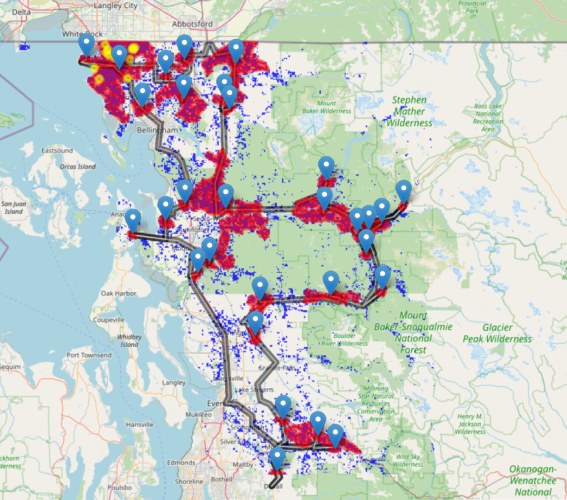

<!-- README.md is generated from README.Rmd. Please edit that file -->

# enmRoute 

<!-- badges: start -->
<!-- badges: end -->

Functions of this package were also provided in Shiny platform at
<https://enmapp.shinyapps.io/enmroute>.

The aim of this package is to use ecological niche model habitat suitability 
predictions to plan field survey in an expected area. Our platform would assist biodiversity survey 
to capture more individuals in the field. We hypothesize that field surveys that account for habitat 
suitability predictions would promote field collections. Our model-based survey route that acocunt for habitat 
suiability predictions and use practiceable driving time/distance to optimize survey efforts, 
we hope that this package and its accompany shinny could help field biologists design sampling
routes for regional and national surveys.

Key Words: Survey route, Optimization, Ecological Niche Model, Habitat suitability, Carrying Capactiy Index (CCI)


###########################################################################################

The core function of enmRoute is to generate and optimize survey route for invasive species surveillence:

enmRoute (pred1, pred2, p, r, obs, b)

pred1: Suitability prediction from ecological niche model, input as raster data

pred2: Binary prediction from ecological niche model, input as raster data

p: Size of tiny patches to be discard (km2)

r: Number of low ranked patches to be discard, they are ranked by Carrying Capacity Index (CCI).

obs: Observations of introduced populations, input as csv of longitude and latitude.

b: The buffering distance of these observations, the unit is meter.


###########################################################################################

enmRoute integrate suitability predictions and observatroins to optimize invasive species survey, it can work under different conditions, 
we illustrate these in detail below.

1)  Exercise 1 is a basic excise that guides the user step by step to generate
    survey route, it demonstrates the inventory scheme for an invasive
    specise that has not been established population (Spotted Latternfly), and an invasive species that has been
    established population at earlier stage (Northern giant hornet), both examples were provided for theri current 
    surveys planning in Washington State in United States. The former one does not account for introduced observation 
    (distributional records) for survey route designning, whereas the latter included earlier detection in survey route designning. 

2)  Exercise 2 is demostrating the idea of survey route ptimization, i.e, how to optimize driving survey route for invasive species surveying. 

## Installation

We can install the `enmRoute` package from GitHub, using the `devtools`
package:

``` r
library(devtools)
devtools::install_github('gpzhu/enmRoute')
```

## loading dependency packages

``` r
library(enmRoute)
library(sf)
library(terra)
library(osrm)
library(leaflet)
library(smoothr)
library(exactextractr)
library(ggpmisc)
library(ggpubr)
```

## Exercise 1

This is a basic exercise which guides user step by step to generate
a survey route. The first step is to change the Ecological Niche Model
suitability prediction into a binary prediction. The binary predictive
surface is then transformed into polygons/patches, they were then combined 
with the buffering of introduced distributional records to generate candidate suvery patches.  

Two procedures are employed below to prioritize these patches, by removing tiny patches (here \<
5km2) and discarding low carrying capacity index (CCI) ranked patches (here, 10 CCI
rear patches).

User inputs data: Occurrence data (occ): an occurrence data with two
columns of longitude and latitude for converting suitability into binary
predictions; Suitability prediction (pred1): a raster surface representing
suitability prediction, that could be attained using ecological niche
model; Binary prediction (pred2): a raster surface representing
binary prediction (presence/absence), that could be attained by thresholding suitability prediction;
Patch size limit (p): minimum patch size (km2) that should be
considered in the survey; Carrying Capacity Index (CCI) limit (r): used to set the
boundary for discarding low CCI ranked patches; Buffering distance (b): the buffering distance (km) 
of observed introduced records.

``` r

###########################################################################################
### read system file data ###
occ <-read.csv(system.file("extdata", "occ.csv", package="enmRoute"))
pred1 <-rast(system.file("extdata", "WA.tif", package="enmRoute"))

################################## Note #####################################
#### Currently, we us WGS 84, you may change coordinate system into equal area projection for below runing of optimization
#### But you have to thange it back to WGS84 below before get the route  ####

#### Threshold model prediction at the 10th training threshold, this threhold is highly conservative in estimating distribution ####
pred2 <- thd(pred1 = pred1, points = occ, type = "p10", binary = TRUE)

## Alternatively, you can use other thresholds (e.g., mtp) to get binary prediction, see detail in thd function
#rc <- thd(pred1 = pred1, points = occ, type = "mtp", binary = TRUE)
## User may also chouse an arbitary threshold that between 0-1000, see discussion on threshold in survey route optimization. 
#rc <- thd(pred1 = pred1, threshold = 388, binary = TRUE)

# Get the buffering of introducted distributional records, the buffering distance unit is meter.

buf<- buf(obs = occ, b = 1000)

## Preparing the candate polygons/pataches, candidate surveying patch/polygos from binary predictions and 
## the bufferrring of introduced distributional records 
## pred2: binary prediction
## obs: observed introduced distributional records
## b: the buffering distance of observed recrods, unit is meter.
can<-canD(pred2 = pred2, obs = occ, b = 1000)

dim(can)
# [1] 2566    3
# There are 2544 pateches generated, this is too much for regular survey, we employ below 2 steps to optimize survey route. 
###########################################################################################
#### The 1th round prioritization ###
#### Ranking and prioritizing patches by removing tiny pieces (< 5km2), ####
pp<-rankCI(pred1 = pred1, canD = can, p = 3)

### These are patches that were reserved after 1th round optimization. 
dim(pp)
#> [1] 41  5

head(pp)
# Simple feature collection with 6 features and 4 fields
# Geometry type: POLYGON
# Dimension:     XY
# Bounding box:  xmin: -122.8133 ymin: 48.47432 xmax: -122.2658 ymax: 49.03811
# CRS:           +proj=longlat +datum=WGS84 +no_defs
#   Capacity WA                       geometry Patch_size Rank
# 1   2155404 NA POLYGON ((-122.61 48.85461,...   3271.264   41
# 3     78328  1 POLYGON ((-122.6625 48.7988...    120.000   19
# 7     89752  1 POLYGON ((-122.5936 48.8283...    141.000   21
# 8    474770  1 POLYGON ((-122.4789 48.8283...    740.000   37
# 10    90523  1 POLYGON ((-122.4723 48.5038...    148.000   22
# 12   201247  1 POLYGON ((-122.4232 48.9332...    265.000   29

### You may write out polygon of 1th round prioritization ###
### st_write(pp, "1th_polygon.shp")

###########################################################################################
#### The 2th round prioritization ###
#### There are 31 paches were reserved after 1th round prioritization,
#### With this number, user can decide how many patches are going to be discarded ######
#### Here, select high ranked/priority patches by discarding the rear 10 CI ranked patches ####
sub<-subset(pp, Rank > 23)

### These are patches that were reserved after 2th round optimization.
dim(sub)
#> [1] 30  5

head(sub)
# Simple feature collection with 6 features and 4 fields
# Geometry type: POLYGON
# Dimension:     XY
# Bounding box:  xmin: -122.8133 ymin: 48.47432 xmax: -122.2658 ymax: 49.03811
# CRS:           +proj=longlat +datum=WGS84 +no_defs
#   Capacity WA                       geometry Patch_size Rank
# 1   2155404 NA POLYGON ((-122.61 48.85461,...   3271.264   41
# 3     78328  1 POLYGON ((-122.6625 48.7988...    120.000   19
# 7     89752  1 POLYGON ((-122.5936 48.8283...    141.000   21
# 8    474770  1 POLYGON ((-122.4789 48.8283...    740.000   37
# 10    90523  1 POLYGON ((-122.4723 48.5038...    148.000   22
# 12   201247  1 POLYGON ((-122.4232 48.9332...    265.000   29
### Get centroid for generating survey route ####
ct<-st_centroid(sub)

dim(ct)
#> [1] 30  5

head(ct)
# Simple feature collection with 6 features and 4 fields
# Geometry type: POINT
# Dimension:     XY
# Bounding box:  xmin: -122.6527 ymin: 48.4947 xmax: -122.3668 ymax: 48.94929
# CRS:           +proj=longlat +datum=WGS84 +no_defs
#   Capacity WA                   geometry Patch_size Rank
# 1   2155404 NA POINT (-122.6527 48.93404)   3271.264   41
# 3     78328  1 POINT (-122.6342 48.79342)    120.000   19
# 7     89752  1 POINT (-122.5409 48.81919)    141.000   21
# 8    474770  1  POINT (-122.3749 48.8474)    740.000   37
# 10    90523  1  POINT (-122.4446 48.4947)    148.000   22
# 12   201247  1 POINT (-122.3668 48.94929)    265.000   29

### You may write out polygon of 2th round prioritization ###
### st_write(sub, "2th_polygon.shp")

### You may write out survey centroid ###
### st_write(ct, "My_centroid.shp")

#### You may use osrmTrip function (osrm package) to get the route here, makesure your coordinate system is WGS84 ######
## ctxy<-as.data.frame(st_coordinates(ct))
## trips <- osrmTrip(loc = ctxy, returnclass = "sf")
## mytrip <- trips[[1]]$trip

###########################################################################################
### Based on former 1th and 2th rounds prioritization, user can decide how many patche can be removed,
### during 1th (p) and 2th (r) rounds prioritizations,
### so, it is ready to run enmRoute 

mm<-enmRoute(pred1 = pred1, pred2 = pred2, p = 3, r = 23, obs = occ, b = 1000)  

### loading results ###
mytrip<-mm$geometry

#### get survey driving time (min) ####
sum(mm$duration)
#> [1] 953.3417

#### get survey driving distance (km) ####
sum(mm$distance)
#> [1] 715.6079

### You may write out survey route ###
### st_write(mytrip, "Mytrip.shp")

###########################################################
### Plot and plan the trip ###
### Solid red line denote proposed survey route,
### Blue and yellow area represent represent patches that were generate by ecological niche model predictios and distributional records buffering. 
### Red areas mean patches that were reserved after 2 rounds prioritizations, dropped pins denote centroids of high ranked patches
xy<-st_coordinates(ct)
ggg<-leaflet()%>%
  addPolygons(data=mytrip,fillOpacity=0,color="red",stroke=T)%>%
  addMarkers(data=xy)%>%addTiles()%>%
  addRasterImage(pred2, colors = "blue", opacity = 0.8)%>%
  addPolygons(data=sub,fillOpacity=0.5,color="red",stroke=T)%>%
  addPolygons(data=buf,fillOpacity=0.5,color="yellow",stroke=T)
  
ggg

### You may write out below result as html widget ###
### library(htmlwidgets)
### saveWidget(ggg, file = "enm_RouteMap.html")
```



## Exercise 2

This is an advanced exercise which could help user to optimize survey
route. It works firstly by running the above procedure in an iterative
manner to generate the relationship between survey expense and number of
sampled patches. Total survey expenses would be depend on surveying
expense spent in these high ranked patches and driving time between the
patches. The driving time would be closely related to the distance
between the centroids of these patches. Patch survey expense would be
scaled with the accumulated capacity index (CI) in these high ranked
patches, as high CI accumulated means more sample should be deployed.

Ts = td + β * CCIs

In this example, I select 100 patches after removing tiny (\< 1km2) and
low ranked (rear 55 patches) to test the relationship between survey
expense and number of sampled patches. With this relationship, field
biologist could decide which/how many patches are going to be used for
deploying samples, given available time and resources.

User inputs: Occurrence data (occ): an occurrence data with two columns
of longitude and latitude for converting suitability into binary
predictions: Suitability prediction (pred1): a raster surface representing
suitability prediction, that could be attained using ecological niche
model; Binary prediction (pred2): a raster surface representing
binary prediction (presence/absence), that could be attained by thresholding suitability prediction;
Patch size limit (p): minimum patch size that should be
considered in the surveying; Capacity index limit (r): capacity index
used to discard low suitability patches; Number of patches to be
iterative removed (u).

``` r
### read system file data ###
occ <-read.csv(system.file("extdata", "occ.csv", package="enmRoute"))
pred1 <-raster(system.file("extdata", "WA.tif", package="enmRoute"))

#### Threshold model prediction ####
pred2 <- thd(pred1 = pred1, threshold = 388, binary = TRUE)

## To start optimization, we will use candidate patches/polygons that generate from former excise. 
can<-canD(pred2 = pred2, obs = occ, b = 5) #This would generate 2566 patches/polygons.

# We calculate CCI for these patches, and then rank them by CCI, we optimize firstly by remove some small size patches (<2 km2).
pp<-rankCI(pred1 = pred1, canD = can, p = 2)

### These are patches that were reserved after 1th round optimization.
dim(pp)
#> [1] 92  5

head(pp)
# Simple feature collection with 6 features and 4 fields
# Geometry type: POLYGON
# Dimension:     XY
# Bounding box:  xmin: -123.0657 ymin: 48.44482 xmax: -122.4822 ymax: 49.03811
# CRS:           +proj=longlat +datum=WGS84 +no_defs
#  Capacity WA                       geometry Patch_size Rank
# 1  2155404 NA POLYGON ((-122.61 48.85461,...   3271.264   92
# 2    35881  1 POLYGON ((-123.0624 48.9923...     47.000   52
# 3    78328  1 POLYGON ((-122.6625 48.7988...    120.000   70
# 4    24516  1 POLYGON ((-122.633 48.76937...     41.000   35
# 5    36670  1 POLYGON ((-122.5904 48.4513...     50.000   53
# 6    26200  1 POLYGON ((-122.5707 48.7956...     40.000   38

###### Tune candidate sites for routing ##########
###### shp is the output of rankCI ###
###### r, number of low ranked patches to be removed ###
###### u, number of patches to be iterative removed ### 
cc<-tuneSite(shp=pp, r=12, u=2)

### These are patches that were reserved after 2th round optimization.
dim(cc)
#> [1] 36  5

head(cc)
#  Proportion_of_patches Driving_time Driving_distance Accumulated_capacity Patch_size
# 1                  0.75     2272.603         1329.218              9586223   14462.26
# 2                  0.73     2141.305         1306.871              9552603   14404.26
# 3                  0.71     2118.675         1300.781              9517536   14347.26
# 4                  0.69     2076.035         1269.831              9481516   14291.26
# 5                  0.67     2047.105         1262.647              9443733   14234.26
# 6                  0.65     2043.175         1259.780              9401148   14167.26

### You may write out iterative running result ###
### write.csv(cc, "Iteration_result.csv", row.names = F)

###plot tuneSite results###
### Relation between survey time/distance and proportion of patches to be sampled
eee<-ggplot(cc, aes(x=Proportion_of_patches, y=Driving_time)) +
     geom_point(size = 5, color = "#FFFFFF", fill = "#000000", shape = 21)+
     geom_smooth(se = T, method = "lm", linewidth=2)+
     stat_poly_eq(aes(label = after_stat(eq.label)),label.y = "bottom", label.x = "right") +
     stat_poly_eq(label.y = 0.9) +
     theme(plot.subtitle = element_text(family = "serif", size = 12, colour = "gray0"), 
        plot.caption = element_text(colour = "gray0"), 
        axis.title = element_text(size = 12), 
        axis.text = element_text(size = 12, colour = "gray0"),
        axis.line = element_line(linetype = "solid"),
        plot.title = element_text(size = 12)) +labs(y = "Driving time (min)", x = "Proportion of patches to be sampled")+
     scale_y_continuous(breaks=seq(0,4500,500))

### Relation between accumulated CCI and proportion of patches to be sampled
formula <- y ~ poly(x, 3, raw = TRUE)
fff<-ggplot(cc, aes(x=Proportion_of_patches, y=Accumulated_capacity)) +
  geom_point(size = 5, color = "#FFFFFF", fill = "#000000", shape = 21)+
  stat_poly_line(formula = formula, linewidth=2,se = T) +
  stat_poly_eq(use_label("eq"), formula = formula,label.y = "bottom", label.x = "right")+
  stat_poly_eq(use_label("R2"), formula = formula)+
  #geom_smooth(se = FALSE, method = "lm", size=2)+
  theme(plot.subtitle = element_text(family = "serif", size = 12, colour = "gray0"), 
        plot.caption = element_text(colour = "gray0"), 
        axis.title = element_text(size = 12), 
        axis.text = element_text(size = 12, colour = "gray0"),
        axis.line = element_line(linetype = "solid"),
        plot.title = element_text(size = 12)) +labs(y = "Accumulated capacity", x = "Proportion of patches to be sampled")
        
ggarrange(eee, fff, labels = c("A", "B"))
```


